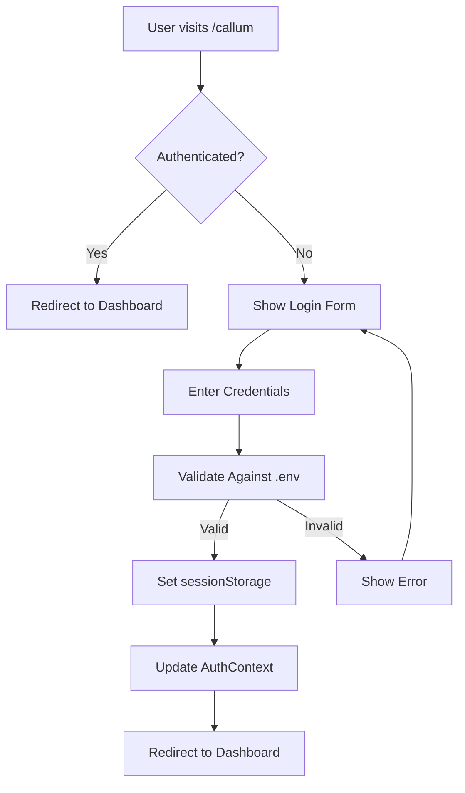

## Overview

The Click Creators Scraper uses a **simple session-based authentication** system with username, password, and OTP verification. Authentication state is managed client-side via React Context and persists across navigation using `sessionStorage`.

<Note>
  The current implementation uses environment variables for credentials. This is suitable for single-user or trusted team environments. For production with multiple users, consider implementing a proper user management system.
</Note>

## Authentication Flow



## Configuration

### Environment Variables

Credentials are stored in `.env.local`:

```bash .env.local
# Authentication Credentials
NEXT_PUBLIC_USERNAME=your-username
NEXT_PUBLIC_PASSWORD=your-password
NEXT_PUBLIC_OTP=123456
```

<Warning>
  These variables are prefixed with `NEXT_PUBLIC_` which means they are exposed to the browser. Never use sensitive production credentials with this pattern.
</Warning>

## AuthContext Implementation

The `AuthContext` manages authentication state throughout the application:

### Context Structure

```typescript contexts/auth-context.tsx
interface AuthContextType {
  isAuthenticated: boolean
  login: () => void
  logout: () => void
  isLoading: boolean
}
```

### Using the Auth Hook

```typescript
import { useAuth } from '@/contexts/auth-context'

function MyComponent() {
  const { isAuthenticated, login, logout, isLoading } = useAuth()
  
  if (isLoading) {
    return <LoadingSpinner />
  }
  
  if (!isAuthenticated) {
    return <LoginPrompt />
  }
  
  return <ProtectedContent />
}
```

## Session Storage

Authentication state is persisted using `sessionStorage`:

```typescript contexts/auth-context.tsx
const login = () => {
  setIsAuthenticated(true)
  // Persist across navigation (but not page refresh)
  sessionStorage.setItem('isAuthenticated', 'true')
}

const logout = () => {
  setIsAuthenticated(false)
  sessionStorage.removeItem('isAuthenticated')
  localStorage.removeItem('isAuthenticated')
}
```

### Session Behavior

<CardGroup cols={2}>
  <Card title="sessionStorage" icon="clock">
    Maintains session during navigation within the same browser tab. Cleared on tab close or page refresh.
  </Card>
  <Card title="localStorage" icon="database">
    Removed on logout to ensure clean state. Not used for primary session management.
  </Card>
</CardGroup>

## Login Implementation

The login page validates credentials against environment variables:

```typescript app/callum/page.tsx
const handleLogin = (e: React.FormEvent) => {
  e.preventDefault()
  
  const envUsername = process.env.NEXT_PUBLIC_USERNAME
  const envPassword = process.env.NEXT_PUBLIC_PASSWORD
  const envOtp = process.env.NEXT_PUBLIC_OTP
  
  if (
    username === envUsername &&
    password === envPassword &&
    otp === envOtp
  ) {
    login() // Update AuthContext
    router.push('/callum-dashboard')
  } else {
    toast({
      title: 'Invalid credentials',
      description: 'Please check your username, password, and OTP.',
      variant: 'destructive'
    })
  }
}
```

### Login Form Fields

<ParamField path="username" type="string" required>
  Username matching `NEXT_PUBLIC_USERNAME` environment variable
</ParamField>

<ParamField path="password" type="string" required>
  Password matching `NEXT_PUBLIC_PASSWORD` environment variable
</ParamField>

<ParamField path="otp" type="string" required>
  One-time password matching `NEXT_PUBLIC_OTP` environment variable
</ParamField>

## Protected Routes

Protect pages by checking authentication status:

```typescript
'use client'

import { useAuth } from '@/contexts/auth-context'
import { useRouter } from 'next/navigation'
import { useEffect } from 'react'

export default function ProtectedPage() {
  const { isAuthenticated, isLoading } = useAuth()
  const router = useRouter()
  
  useEffect(() => {
    if (!isLoading && !isAuthenticated) {
      router.push('/callum') // Redirect to login
    }
  }, [isAuthenticated, isLoading, router])
  
  if (isLoading) {
    return <LoadingSpinner />
  }
  
  if (!isAuthenticated) {
    return null // Will redirect
  }
  
  return (
    <div>
      {/* Protected content */}
    </div>
  )
}
```

## Multi-Tenant Isolation (X-Base-Id)

While authentication manages user sessions, **multi-tenant data isolation** is handled separately via the `X-Base-Id` header:

```typescript lib/api.ts
export async function apiRequest(
  url: string,
  baseId: string,
  config?: ApiRequestConfig
): Promise<Response> {
  if (!baseId) {
    throw new Error('base_id is required for API requests')
  }
  
  const headers = new Headers(config?.headers)
  headers.set('X-Base-Id', baseId)
  headers.set('Content-Type', 'application/json')
  
  return fetch(url, {
    ...config,
    headers
  })
}
```

### Base ID Flow

1. **User logs in** → `AuthContext` sets `isAuthenticated = true`
2. **BaseProvider loads** → Fetches active scraping job from Supabase
3. **base_id extracted** → From active job's `base_id` column
4. **All API requests** → Include `X-Base-Id` header for data isolation

```typescript
import { useBase } from '@/contexts/base-context'
import { apiPost } from '@/lib/api'

function MyComponent() {
  const { baseId } = useBase()
  
  const scrapeFollowers = async () => {
    // X-Base-Id header automatically added
    await apiPost('/api/scrape-followers', baseId, {
      accounts: ['user1', 'user2']
    })
  }
}
```

<Note>
  The `X-Base-Id` header ensures that different scraping jobs (e.g., different influencers or campaigns) maintain separate data in the database.
</Note>

## Backend API Authentication

The Flask backend uses **API keys** for external service authentication:

### Supabase Authentication

```python backend/.env
SUPABASE_URL=https://your-project.supabase.co
SUPABASE_KEY=your-service-role-key
```

The backend uses the **service role key** for full database access:

```python
from supabase import create_client

supabase = create_client(
    os.getenv('SUPABASE_URL'),
    os.getenv('SUPABASE_KEY')  # Service role key
)
```

### Apify Authentication

```python backend/.env
APIPY_API_KEY=your-apify-key
APIPY_ACTOR_ID=your-actor-id
```

Used for Instagram scraping:

```python
from apify_client import ApifyClient

client = ApifyClient(os.getenv('APIFY_API_KEY'))
run = client.actor(os.getenv('APIFY_ACTOR_ID')).call({
    'usernames': ['account1', 'account2']
})
```

### Airtable Authentication

```python backend/.env
AIRTABLE_API_KEY=your-airtable-key
AIRTABLE_BASE_ID=your-base-id
```

Used for syncing profiles to VA tables:

```python
import requests

headers = {
    'Authorization': f'Bearer {os.getenv("AIRTABLE_API_KEY")}',
    'Content-Type': 'application/json'
}
```

## Security Considerations

<Warning>
  The current authentication implementation is **not production-ready** for multi-user scenarios. Consider these improvements:
</Warning>

### Current Limitations

| Issue | Impact |
|-------|--------|
| Environment variable credentials | All users share same credentials |
| Client-side validation | Credentials exposed in browser |
| No session expiration | Sessions persist until logout |
| No password hashing | Plain text comparison |

### Recommended Improvements

<CardGroup cols={2}>
  <Card title="Server-Side Auth" icon="server">
    Move credential validation to backend API endpoints
  </Card>
  <Card title="JWT Tokens" icon="key">
    Implement JWT-based authentication with expiration
  </Card>
  <Card title="User Database" icon="database">
    Store users in Supabase with hashed passwords
  </Card>
  <Card title="Role-Based Access" icon="shield">
    Add user roles (admin, VA, viewer) for permissions
  </Card>
</CardGroup>

## Error Handling

### Invalid Credentials

```typescript
if (username !== envUsername || password !== envPassword || otp !== envOtp) {
  toast({
    title: 'Invalid credentials',
    description: 'Please check your username, password, and OTP.',
    variant: 'destructive'
  })
  return
}
```

### Missing Base ID

```typescript
if (!baseId) {
  throw new Error(
    'base_id is required for API requests. Did you forget to provide it from useBase()?'
  )
}
```

### Session Expired

```typescript
const { isAuthenticated, isLoading } = useAuth()

if (!isLoading && !isAuthenticated) {
  router.push('/callum')
  toast({
    title: 'Session expired',
    description: 'Please log in again.'
  })
}
```

## Logout Flow

```typescript
import { useAuth } from '@/contexts/auth-context'
import { useRouter } from 'next/navigation'

function LogoutButton() {
  const { logout } = useAuth()
  const router = useRouter()
  
  const handleLogout = () => {
    logout() // Clears sessionStorage and localStorage
    router.push('/callum') // Redirect to login
    toast({
      title: 'Logged out',
      description: 'You have been successfully logged out.'
    })
  }
  
  return <Button onClick={handleLogout}>Logout</Button>
}
```

## Complete Authentication Example

<CodeGroup>
```typescript Login Page
'use client'

import { useState } from 'react'
import { useAuth } from '@/contexts/auth-context'
import { useRouter } from 'next/navigation'
import { useToast } from '@/hooks/use-toast'

export default function LoginPage() {
  const [username, setUsername] = useState('')
  const [password, setPassword] = useState('')
  const [otp, setOtp] = useState('')
  const { login } = useAuth()
  const router = useRouter()
  const { toast } = useToast()
  
  const handleSubmit = (e: React.FormEvent) => {
    e.preventDefault()
    
    if (
      username === process.env.NEXT_PUBLIC_USERNAME &&
      password === process.env.NEXT_PUBLIC_PASSWORD &&
      otp === process.env.NEXT_PUBLIC_OTP
    ) {
      login()
      router.push('/callum-dashboard')
    } else {
      toast({
        title: 'Invalid credentials',
        variant: 'destructive'
      })
    }
  }
  
  return (
    <form onSubmit={handleSubmit}>
      <input
        type="text"
        value={username}
        onChange={(e) => setUsername(e.target.value)}
        placeholder="Username"
      />
      <input
        type="password"
        value={password}
        onChange={(e) => setPassword(e.target.value)}
        placeholder="Password"
      />
      <input
        type="text"
        value={otp}
        onChange={(e) => setOtp(e.target.value)}
        placeholder="OTP"
      />
      <button type="submit">Login</button>
    </form>
  )
}
```

```typescript Protected Dashboard
'use client'

import { useAuth } from '@/contexts/auth-context'
import { useBase } from '@/contexts/base-context'
import { useRouter } from 'next/navigation'
import { useEffect } from 'react'

export default function Dashboard() {
  const { isAuthenticated, isLoading: authLoading } = useAuth()
  const { baseId, isLoading: baseLoading } = useBase()
  const router = useRouter()
  
  useEffect(() => {
    if (!authLoading && !isAuthenticated) {
      router.push('/callum')
    }
  }, [isAuthenticated, authLoading, router])
  
  if (authLoading || baseLoading) {
    return <LoadingSpinner />
  }
  
  if (!isAuthenticated || !baseId) {
    return null
  }
  
  return (
    <div>
      <h1>Dashboard</h1>
      <p>Base ID: {baseId}</p>
      {/* Protected content */}
    </div>
  )
}
```
</CodeGroup>

## Next Steps

<CardGroup cols={2}>
  <Card title="API Overview" icon="book" href="/api/overview">
    Learn about the API architecture and available endpoints
  </Card>
  <Card title="Multi-Tenant Context" icon="database" href="/database/overview">
    Understand the base_id pattern and data isolation
  </Card>
</CardGroup>