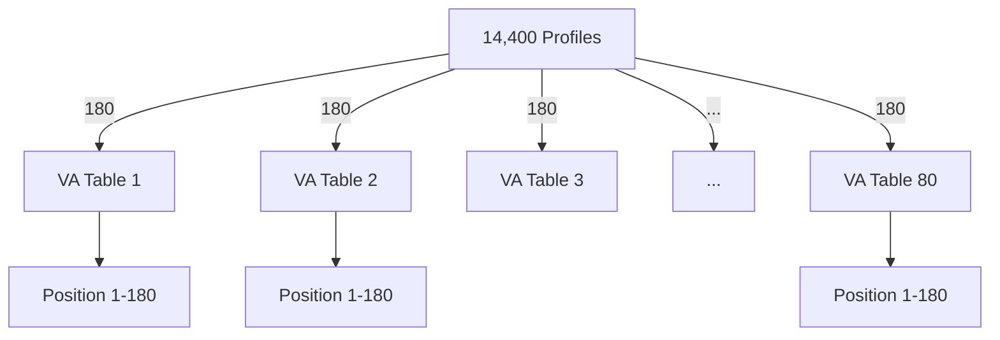
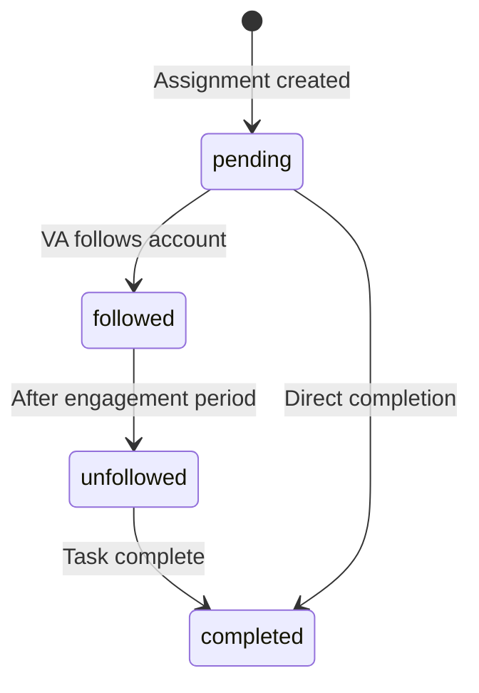
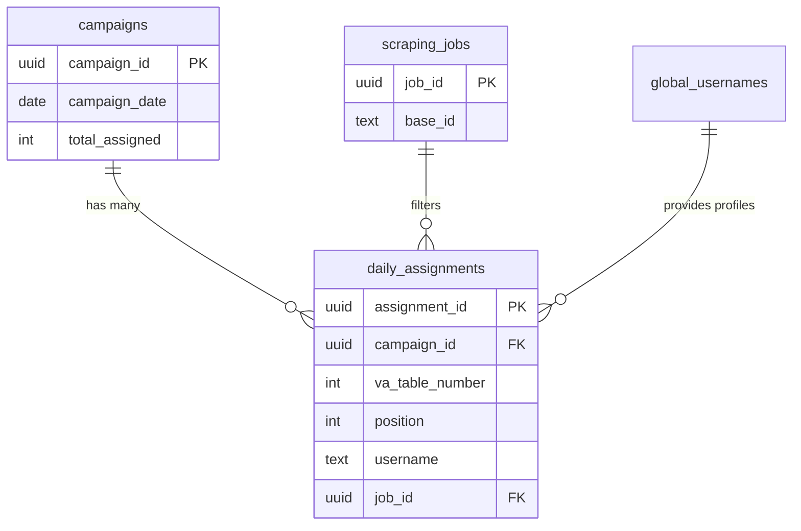

## Overview

The `daily_assignments` table stores the **distribution of profiles to Virtual Assistants (VAs)**. Each campaign assigns 14,400 profiles across 80 VA tables, with 180 profiles per VA.

## Table Schema

### SQL Definition

```sql
CREATE TABLE daily_assignments (
  assignment_id UUID PRIMARY KEY DEFAULT uuid_generate_v4(),
  campaign_id UUID REFERENCES campaigns(campaign_id) ON DELETE CASCADE,
  va_table_number INTEGER NOT NULL,
  position INTEGER NOT NULL,
  id TEXT NOT NULL,              -- Instagram profile ID
  username TEXT NOT NULL,
  full_name TEXT,
  assigned_at TIMESTAMP DEFAULT NOW(),
  status TEXT DEFAULT 'pending',
  updated_at TIMESTAMP,
  job_id UUID REFERENCES scraping_jobs(job_id)
);
```

### Column Details

| Column | Type | Constraints | Description |
|--------|------|-------------|-------------|
| `assignment_id` | UUID | PRIMARY KEY | Unique assignment identifier |
| `campaign_id` | UUID | FOREIGN KEY | Links to campaign |
| `va_table_number` | INTEGER | NOT NULL | VA table (1-80) |
| `position` | INTEGER | NOT NULL | Position within VA table (1-180) |
| `id` | TEXT | NOT NULL | Instagram profile ID |
| `username` | TEXT | NOT NULL | Instagram username |
| `full_name` | TEXT | - | Display name |
| `assigned_at` | TIMESTAMP | DEFAULT NOW() | When assigned |
| `status` | TEXT | DEFAULT 'pending' | Assignment status |
| `updated_at` | TIMESTAMP | - | Last status update |
| `job_id` | UUID | FOREIGN KEY | Multi-tenant isolation key |

## TypeScript Interface

```typescript
export type AssignmentStatus = 
  | 'pending'    // Assigned but not yet actioned
  | 'followed'   // VA followed the account
  | 'unfollowed' // VA unfollowed the account
  | 'completed'  // Assignment complete

export interface DailyAssignment {
  assignment_id: string;
  campaign_id: string;
  va_table_number: number;
  position: number;
  id: string;
  username: string;
  full_name: string | null;
  assigned_at: string;
  status: AssignmentStatus;
  updated_at: string | null;
  job_id: string | null;
}
```

## Distribution Logic

### VA Distribution Formula

<Note>
  **Standard distribution**:
  - Total profiles: 14,400
  - Number of VAs: 80
  - Profiles per VA: 180 (14,400 ÷ 80)
</Note>

### Distribution Algorithm

```typescript
async function distributeProfilesToVAs(
  campaignId: string,
  profiles: GlobalUsername[],
  numVAs: number = 80
) {
  const profilesPerVA = Math.floor(profiles.length / numVAs)
  const assignments: DailyAssignment[] = []
  
  for (let vaNumber = 1; vaNumber <= numVAs; vaNumber++) {
    const startIdx = (vaNumber - 1) * profilesPerVA
    const endIdx = startIdx + profilesPerVA
    const vaProfiles = profiles.slice(startIdx, endIdx)
    
    vaProfiles.forEach((profile, idx) => {
      assignments.push({
        campaign_id: campaignId,
        va_table_number: vaNumber,
        position: idx + 1,
        id: profile.id,
        username: profile.username,
        full_name: profile.full_name,
        status: 'pending',
        job_id: currentJobId
      })
    })
  }
  
  // Bulk insert to database
  await supabase
    .from('daily_assignments')
    .insert(assignments)
}
```

### Visual Distribution



## Assignment Status Flow

### Status Lifecycle



### Status Descriptions

<Accordion title="Pending">
  **Initial state** when assignment is created.
  
  - Profile assigned to VA table
  - Synced to Airtable
  - Waiting for VA action
  - No engagement yet
  
  ```typescript
  status: 'pending'
  ```
</Accordion>

<Accordion title="Followed">
  **Active engagement** - VA has followed the Instagram account.
  
  - VA clicked "Follow" in Airtable
  - Instagram follow action completed
  - Tracking engagement metrics
  - Waiting for unfollow period
  
  ```typescript
  status: 'followed'
  updated_at: new Date().toISOString()
  ```
</Accordion>

<Accordion title="Unfollowed">
  **Post-engagement** - VA has unfollowed the account.
  
  - Engagement period complete (typically 24-48 hours)
  - VA unfollowed the account
  - Ready for completion
  
  ```typescript
  status: 'unfollowed'
  updated_at: new Date().toISOString()
  ```
</Accordion>

<Accordion title="Completed">
  **Final state** - Assignment fully processed.
  
  - All actions complete
  - Can be archived
  - Metrics recorded
  
  ```typescript
  status: 'completed'
  updated_at: new Date().toISOString()
  ```
</Accordion>

## Airtable Integration

### Sync Process

```typescript
async function syncToAirtable(campaignId: string) {
  // 1. Get all assignments for campaign
  const { data: assignments } = await supabase
    .from('daily_assignments')
    .select('*')
    .eq('campaign_id', campaignId)
    .order('va_table_number')
    .order('position')
  
  // 2. Group by VA table
  const assignmentsByVA = groupBy(assignments, 'va_table_number')
  
  // 3. Sync each VA table to Airtable
  for (const [vaNumber, profiles] of Object.entries(assignmentsByVA)) {
    const tableName = `VA ${vaNumber}`
    
    await airtable
      .base(airtableBaseId)
      .table(tableName)
      .create(
        profiles.map(p => ({
          fields: {
            'Username': p.username,
            'Full Name': p.full_name,
            'Profile ID': p.id,
            'Status': p.status,
            'Position': p.position,
            'Assigned Date': p.assigned_at
          }
        }))
      )
  }
}
```

### Airtable Table Structure

Each VA has a dedicated Airtable table:

| Field Name | Type | Description |
|------------|------|-------------|
| Username | Single line text | Instagram username |
| Full Name | Single line text | Display name |
| Profile ID | Single line text | Instagram profile ID |
| Status | Single select | pending, followed, unfollowed, completed |
| Position | Number | Order within table (1-180) |
| Assigned Date | Date | When assigned |
| Profile URL | Formula | `CONCATENATE("https://instagram.com/", {Username})` |

## Common Queries

### Get Assignments for Campaign

```typescript
const { data: assignments } = await supabase
  .from('daily_assignments')
  .select('*')
  .eq('campaign_id', campaignId)
  .order('va_table_number')
  .order('position')
```

### Get Assignments for Specific VA

```typescript
const { data: vaAssignments } = await supabase
  .from('daily_assignments')
  .select('username, full_name, status, position')
  .eq('campaign_id', campaignId)
  .eq('va_table_number', 5) // VA #5
  .order('position')
```

### Count Assignments by Status

```sql
SELECT 
  status,
  COUNT(*) as count,
  ROUND(COUNT(*) * 100.0 / SUM(COUNT(*)) OVER (), 2) as percentage
FROM daily_assignments
WHERE campaign_id = 'your-campaign-id'
GROUP BY status
ORDER BY count DESC;
```

### Update Assignment Status

```typescript
// VA marks profile as followed
const { error } = await supabase
  .from('daily_assignments')
  .update({ 
    status: 'followed',
    updated_at: new Date().toISOString()
  })
  .eq('assignment_id', assignmentId)
```

### Get VA Performance Metrics

```sql
SELECT 
  va_table_number,
  COUNT(*) as total_assigned,
  COUNT(*) FILTER (WHERE status = 'completed') as completed,
  COUNT(*) FILTER (WHERE status = 'followed') as in_progress,
  COUNT(*) FILTER (WHERE status = 'pending') as not_started,
  ROUND(
    COUNT(*) FILTER (WHERE status = 'completed') * 100.0 / COUNT(*),
    2
  ) as completion_rate
FROM daily_assignments
WHERE campaign_id = 'your-campaign-id'
GROUP BY va_table_number
ORDER BY va_table_number;
```

## Multi-Tenant Isolation

### Filtering by Job ID

<Warning>
  Always filter assignments by `job_id` to ensure multi-tenant data isolation:
</Warning>

```typescript
import { createSupabaseClientWithContext } from '@/lib/supabase'

const supabase = createSupabaseClientWithContext(baseId)

// Automatically filtered by job_id via RLS
const { data } = await supabase
  .from('daily_assignments')
  .select('*')
  .eq('campaign_id', campaignId)
```

### RLS Policy Example

```sql
CREATE POLICY "Users can only see their job's assignments"
  ON daily_assignments
  FOR SELECT
  USING (
    job_id IN (
      SELECT job_id 
      FROM scraping_jobs 
      WHERE base_id = current_setting('request.headers')::json->>'x-base-id'
    )
  );
```

## Performance Optimization

### Indexing

```sql
-- For campaign queries
CREATE INDEX idx_daily_assignments_campaign 
  ON daily_assignments(campaign_id, va_table_number, position);

-- For VA-specific queries
CREATE INDEX idx_daily_assignments_va 
  ON daily_assignments(va_table_number, status);

-- For job-based filtering
CREATE INDEX idx_daily_assignments_job 
  ON daily_assignments(job_id, campaign_id);

-- For status tracking
CREATE INDEX idx_daily_assignments_status 
  ON daily_assignments(status, updated_at DESC);
```

### Bulk Operations

```typescript
// Good: Bulk insert assignments
const { error } = await supabase
  .from('daily_assignments')
  .insert(assignments) // Array of 14,400 items

// Bad: Individual inserts (very slow)
for (const assignment of assignments) {
  await supabase.from('daily_assignments').insert(assignment)
}
```

### Pagination

```typescript
// Paginate large result sets
const PAGE_SIZE = 100

const { data, count } = await supabase
  .from('daily_assignments')
  .select('*', { count: 'exact' })
  .eq('campaign_id', campaignId)
  .range(page * PAGE_SIZE, (page + 1) * PAGE_SIZE - 1)
```

## Relationships

### Foreign Keys



### Cascade Delete

```sql
-- When a campaign is deleted, all assignments are removed
ALTER TABLE daily_assignments
  ADD CONSTRAINT fk_campaign_cascade
  FOREIGN KEY (campaign_id)
  REFERENCES campaigns(campaign_id)
  ON DELETE CASCADE;
```

## VA Table Management

### Creating VA Tables

VA tables (1-80) are created in Airtable when a scraping job is initialized:

```typescript
async function createVATables(baseId: string, numVAs: number) {
  const airtable = new Airtable({ apiKey: AIRTABLE_API_KEY })
  const base = airtable.base(baseId)
  
  for (let i = 1; i <= numVAs; i++) {
    await base.createTable({
      name: `VA ${i}`,
      fields: [
        { name: 'Username', type: 'singleLineText' },
        { name: 'Full Name', type: 'singleLineText' },
        { name: 'Profile ID', type: 'singleLineText' },
        { name: 'Status', type: 'singleSelect', options: {
          choices: [
            { name: 'pending' },
            { name: 'followed' },
            { name: 'unfollowed' },
            { name: 'completed' }
          ]
        }},
        { name: 'Position', type: 'number' },
        { name: 'Assigned Date', type: 'date' }
      ]
    })
  }
}
```

### Rate Limiting

<Note>
  Airtable API has rate limits:
  - **5 requests per second** per base
  - Implement delays between batch syncs
</Note>

```typescript
// Batch sync with rate limiting
for (let i = 0; i < batches.length; i++) {
  await syncBatchToAirtable(batches[i])
  
  // Wait 250ms between batches (4 requests/second)
  if (i < batches.length - 1) {
    await new Promise(resolve => setTimeout(resolve, 250))
  }
}
```

## Best Practices

<CardGroup cols={2}>
  <Card title="Sequential Distribution" icon="list-ol">
    Maintain position order (1-180) within each VA table for consistency
  </Card>
  
  <Card title="Bulk Operations" icon="layer-group">
    Always use bulk inserts for assignments (14,400 records)
  </Card>
  
  <Card title="Status Updates" icon="clock-rotate-left">
    Update `updated_at` timestamp when changing assignment status
  </Card>
  
  <Card title="Rate Limit Awareness" icon="gauge-high">
    Implement delays when syncing to Airtable to avoid rate limits
  </Card>
</CardGroup>

## Troubleshooting

### Missing Assignments

```typescript
// Verify all assignments created
const { count } = await supabase
  .from('daily_assignments')
  .select('*', { count: 'exact', head: true })
  .eq('campaign_id', campaignId)

if (count !== 14400) {
  console.error(`Expected 14,400 assignments, found ${count}`)
}
```

### Airtable Sync Failures

```typescript
// Check which VA tables failed to sync
const { data: assignments } = await supabase
  .from('daily_assignments')
  .select('va_table_number')
  .eq('campaign_id', campaignId)

const vaTables = new Set(assignments.map(a => a.va_table_number))
const missingTables = []

for (let i = 1; i <= 80; i++) {
  if (!vaTables.has(i)) {
    missingTables.push(i)
  }
}

console.log('Missing VA tables:', missingTables)
```

## Next Steps

<CardGroup cols={2}>
  <Card title="Campaigns" icon="calendar" href="/database/campaigns">
    Learn about campaign creation and management
  </Card>
  <Card title="Profile Tables" icon="database" href="/database/profiles">
    Understand the profile pool
  </Card>
  <Card title="API Reference" icon="code" href="/api/campaigns/distribute">
    View distribution API documentation
  </Card>
  <Card title="Airtable Setup" icon="table" href="/features/airtable-sync">
    Configure Airtable integration
  </Card>
</CardGroup>