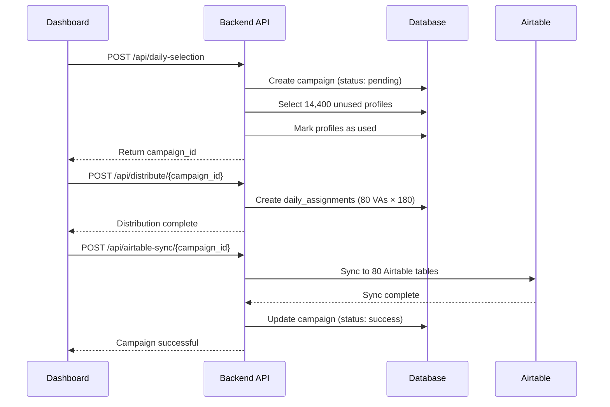
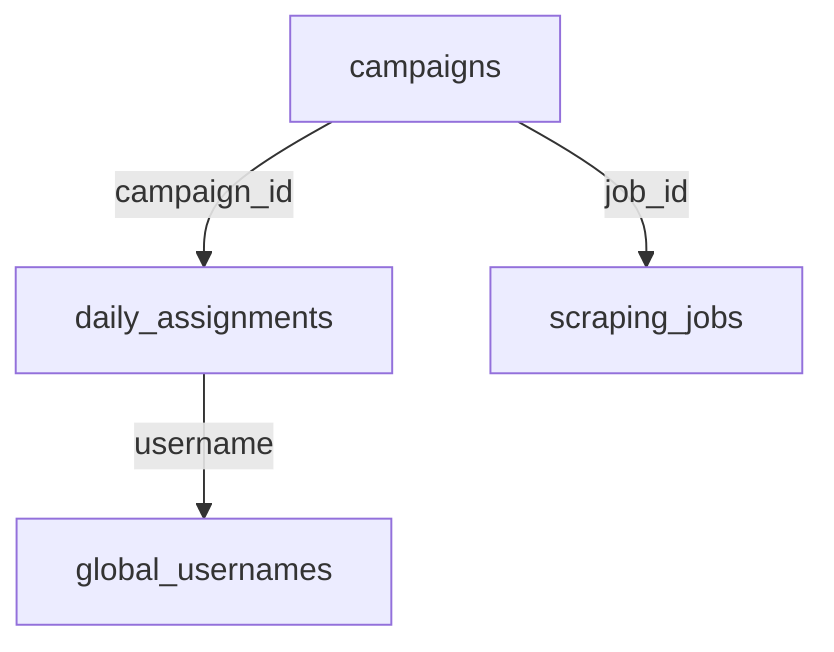

## Overview

The `campaigns` table tracks **daily profile assignment batches**. Each campaign represents a batch of 14,400 profiles distributed to 80 Virtual Assistants (VAs) for Instagram engagement.

## Table Schema

### SQL Definition

```sql
CREATE TABLE campaigns (
  campaign_id UUID PRIMARY KEY DEFAULT uuid_generate_v4(),
  campaign_date DATE NOT NULL,
  total_assigned INTEGER NOT NULL,
  status TEXT CHECK (status IN ('pending', 'success', 'failed')),
  created_at TIMESTAMP DEFAULT NOW(),
  job_id UUID REFERENCES scraping_jobs(job_id)
);
```

### Column Details

| Column | Type | Constraints | Description |
|--------|------|-------------|-------------|
| `campaign_id` | UUID | PRIMARY KEY | Unique campaign identifier |
| `campaign_date` | DATE | NOT NULL | Date of campaign execution |
| `total_assigned` | INTEGER | NOT NULL | Number of profiles assigned (typically 14,400) |
| `status` | TEXT | CHECK constraint | Campaign status (pending, success, failed) |
| `created_at` | TIMESTAMP | DEFAULT NOW() | When campaign was created |
| `job_id` | UUID | FOREIGN KEY | Links to scraping job (multi-tenant isolation) |

## TypeScript Interface

```typescript
export type CampaignStatus = 'pending' | 'success' | 'failed';

export interface Campaign {
  campaign_id: string;
  campaign_date: string; // ISO date string
  total_assigned: number;
  status: CampaignStatus;
  created_at: string;
  job_id: string | null;
}

export interface CampaignWithAssignments extends Campaign {
  assignments: DailyAssignment[];
  assignment_count?: number;
}
```

## Campaign Status Types

### Pending

<Card title="Pending" icon="clock" color="#64748b">
  **When**: Campaign is being created or profiles are being distributed
  
  **Characteristics**:
  - Campaign record created
  - Profile selection in progress
  - VA distribution ongoing
  - Airtable sync not yet complete
  
  **UI Display**: Grey badge with "Pending" label
</Card>

### Success

<Card title="Success" icon="circle-check" color="#16a34a">
  **When**: All profiles successfully assigned and synced to Airtable
  
  **Characteristics**:
  - All 14,400 profiles assigned
  - Distributed to 80 VA tables (180 each)
  - Airtable sync completed
  - VAs can access profiles
  
  **UI Display**: Green badge with "Success" label
</Card>

### Failed

<Card title="Failed" icon="circle-xmark" color="#dc2626">
  **When**: Campaign creation or sync encountered errors
  
  **Characteristics**:
  - Profile selection failed (not enough profiles)
  - Distribution error occurred
  - Airtable sync failed
  - Requires manual intervention
  
  **UI Display**: Red badge with "Failed" label
</Card>

## Campaign Workflow

### Complete Campaign Creation Process



### API Endpoints

<Accordion title="POST /api/daily-selection">
  **Creates campaign and selects profiles**
  
  ```typescript
  const response = await fetch(`${API_URL}/api/daily-selection`, {
    method: 'POST',
    headers: { 'Content-Type': 'application/json' },
    body: JSON.stringify({
      job_id: currentJobId,
      target_count: 14400
    })
  })
  
  const { campaign_id, total_selected } = await response.json()
  ```
  
  **Response**:
  ```json
  {
    "success": true,
    "campaign_id": "uuid-here",
    "total_selected": 14400,
    "campaign_date": "2025-10-06"
  }
  ```
</Accordion>

<Accordion title="POST /api/distribute/{campaign_id}">
  **Distributes profiles to VA tables**
  
  ```typescript
  const response = await fetch(
    `${API_URL}/api/distribute/${campaignId}`,
    { method: 'POST' }
  )
  
  const { va_tables, profiles_per_table } = await response.json()
  ```
  
  **Response**:
  ```json
  {
    "success": true,
    "campaign_id": "uuid-here",
    "va_tables": 80,
    "profiles_per_table": 180
  }
  ```
</Accordion>

<Accordion title="POST /api/airtable-sync/{campaign_id}">
  **Syncs profiles to Airtable**
  
  ```typescript
  const response = await fetch(
    `${API_URL}/api/airtable-sync/${campaignId}`,
    { method: 'POST' }
  )
  
  const { tables_synced } = await response.json()
  ```
  
  **Response**:
  ```json
  {
    "success": true,
    "campaign_id": "uuid-here",
    "tables_synced": 80,
    "total_records": 14400
  }
  ```
</Accordion>

## Common Queries

### Create a New Campaign

```typescript
const { data: campaign, error } = await supabase
  .from('campaigns')
  .insert({
    campaign_date: new Date().toISOString().split('T')[0],
    total_assigned: 14400,
    status: 'pending',
    job_id: currentJobId
  })
  .select()
  .single()
```

### Get Recent Campaigns

```typescript
const { data: campaigns } = await supabase
  .from('campaigns')
  .select('*')
  .eq('job_id', jobId)
  .order('created_at', { ascending: false })
  .limit(10)
```

### Update Campaign Status

```typescript
const { error } = await supabase
  .from('campaigns')
  .update({ status: 'success' })
  .eq('campaign_id', campaignId)
```

### Get Campaign with Assignment Count

```typescript
const { data } = await supabase
  .from('campaigns')
  .select(`
    *,
    assignments:daily_assignments(count)
  `)
  .eq('campaign_id', campaignId)
  .single()
```

### Get Campaigns by Date Range

```sql
SELECT 
  campaign_id,
  campaign_date,
  total_assigned,
  status
FROM campaigns
WHERE job_id = 'your-job-id'
  AND campaign_date BETWEEN '2025-10-01' AND '2025-10-31'
ORDER BY campaign_date DESC;
```

## Campaign Metrics

### Daily Target

<Note>
  **Standard campaign size**: 14,400 profiles
  
  This number is calculated as:
  - 80 VAs × 180 profiles per VA = 14,400 total
</Note>

### Success Metrics

```typescript
// Calculate campaign success rate
const { data: stats } = await supabase
  .from('campaigns')
  .select('status')
  .eq('job_id', jobId)

const total = stats.length
const successful = stats.filter(c => c.status === 'success').length
const successRate = (successful / total) * 100

console.log(`Success rate: ${successRate.toFixed(1)}%`)
```

### Weekly Capacity

```sql
SELECT 
  DATE_TRUNC('week', campaign_date) as week_start,
  COUNT(*) as campaigns_count,
  SUM(total_assigned) as total_profiles,
  COUNT(*) FILTER (WHERE status = 'success') as successful_campaigns
FROM campaigns
WHERE job_id = 'your-job-id'
  AND campaign_date > NOW() - INTERVAL '30 days'
GROUP BY DATE_TRUNC('week', campaign_date)
ORDER BY week_start DESC;
```

## Campaign Lifecycle Management

### 7-Day Cleanup

Campaigns older than 7 days should be cleaned up to free profiles for reuse:

```typescript
// Run via cron job daily at 2 AM
async function cleanupOldCampaigns() {
  const sevenDaysAgo = new Date()
  sevenDaysAgo.setDate(sevenDaysAgo.getDate() - 7)
  
  // 1. Get old campaigns
  const { data: oldCampaigns } = await supabase
    .from('campaigns')
    .select('campaign_id')
    .eq('job_id', jobId)
    .lt('campaign_date', sevenDaysAgo.toISOString())
  
  // 2. Get assigned usernames
  const { data: assignments } = await supabase
    .from('daily_assignments')
    .select('username')
    .in('campaign_id', oldCampaigns.map(c => c.campaign_id))
  
  // 3. Mark profiles as unused
  await supabase
    .from('global_usernames')
    .update({ used: false, used_at: null })
    .in('username', assignments.map(a => a.username))
    .eq('job_id', jobId)
  
  // 4. Delete old assignments
  await supabase
    .from('daily_assignments')
    .delete()
    .in('campaign_id', oldCampaigns.map(c => c.campaign_id))
  
  // 5. Delete old campaigns
  await supabase
    .from('campaigns')
    .delete()
    .in('campaign_id', oldCampaigns.map(c => c.campaign_id))
}
```

<Warning>
  **Critical**: Always run cleanup during off-peak hours (2-4 AM) to avoid conflicts with active campaigns.
</Warning>

### Cleanup API Endpoint

```bash
# Setup cron job
0 2 * * * curl -X POST http://localhost:5001/api/cleanup
```

## Relationships

### One-to-Many with Assignments



### Foreign Key Cascade

```sql
-- When a campaign is deleted, all assignments are also deleted
ALTER TABLE daily_assignments
  ADD CONSTRAINT fk_campaign
  FOREIGN KEY (campaign_id)
  REFERENCES campaigns(campaign_id)
  ON DELETE CASCADE;
```

## UI Components

### Campaign Table Display

From `campaigns-table.tsx`:

```typescript
function CampaignsTable({ baseId }: { baseId: string }) {
  const [campaigns, setCampaigns] = useState<Campaign[]>([])
  
  useEffect(() => {
    async function fetchCampaigns() {
      const supabase = createSupabaseClientWithContext(baseId)
      
      const { data } = await supabase
        .from('campaigns')
        .select('*')
        .order('created_at', { ascending: false })
        .limit(20)
      
      setCampaigns(data || [])
    }
    
    fetchCampaigns()
  }, [baseId])
  
  return (
    <Table>
      {campaigns.map(campaign => (
        <TableRow key={campaign.campaign_id}>
          <TableCell>{campaign.campaign_date}</TableCell>
          <TableCell>{campaign.total_assigned}</TableCell>
          <TableCell>
            <Badge variant={getStatusVariant(campaign.status)}>
              {campaign.status}
            </Badge>
          </TableCell>
        </TableRow>
      ))}
    </Table>
  )
}
```

### Status Badge Colors

```typescript
function getStatusVariant(status: CampaignStatus) {
  switch (status) {
    case 'success':
      return 'success' // Green
    case 'failed':
      return 'destructive' // Red
    case 'pending':
      return 'secondary' // Grey
  }
}
```

## Best Practices

<CardGroup cols={2}>
  <Card title="Check Profile Availability" icon="magnifying-glass">
    Always verify ≥14,400 unused profiles exist before creating a campaign
  </Card>
  
  <Card title="Handle Failures Gracefully" icon="triangle-exclamation">
    Set status to 'failed' and log errors for debugging and retry
  </Card>
  
  <Card title="Sequential API Calls" icon="list-ol">
    Never run distribute/sync in parallel - they must execute sequentially
  </Card>
  
  <Card title="Multi-Tenant Filtering" icon="filter">
    Always filter campaigns by job_id to ensure data isolation
  </Card>
</CardGroup>

## Performance Optimization

### Indexing

```sql
-- For recent campaigns queries
CREATE INDEX idx_campaigns_job_created 
  ON campaigns(job_id, created_at DESC);

-- For date range queries
CREATE INDEX idx_campaigns_date 
  ON campaigns(campaign_date DESC);

-- For status filtering
CREATE INDEX idx_campaigns_status 
  ON campaigns(status) 
  WHERE status IN ('pending', 'failed');
```

### Query Optimization

```typescript
// Bad: Fetches all campaigns
const { data } = await supabase
  .from('campaigns')
  .select('*')

// Good: Limits and filters
const { data } = await supabase
  .from('campaigns')
  .select('campaign_id, campaign_date, status')
  .eq('job_id', jobId)
  .limit(20)
  .order('created_at', { ascending: false })
```

## Troubleshooting

### Campaign Stuck in Pending

```typescript
// Check if campaign completed distribution
const { data } = await supabase
  .from('daily_assignments')
  .select('*', { count: 'exact', head: true })
  .eq('campaign_id', campaignId)

if (count < 14400) {
  // Distribution incomplete - retry or mark as failed
}
```

### Insufficient Profiles Error

```typescript
// Check available profiles before creating campaign
const { count } = await supabase
  .from('global_usernames')
  .select('*', { count: 'exact', head: true })
  .eq('used', false)
  .eq('job_id', jobId)

if (count < 14400) {
  throw new Error(`Only ${count} profiles available. Need 14,400.`)
}
```

## Next Steps

<CardGroup cols={2}>
  <Card title="Daily Assignments" icon="users" href="/database/assignments">
    Learn how profiles are assigned to VAs
  </Card>
  <Card title="Profile Tables" icon="database" href="/database/profiles">
    Understand the profile pool
  </Card>
  <Card title="API Reference" icon="code" href="/api/campaigns/daily-selection">
    View campaign creation API
  </Card>
  <Card title="Cleanup Guide" icon="broom" href="/api/campaigns/cleanup">
    Campaign lifecycle management
  </Card>
</CardGroup>