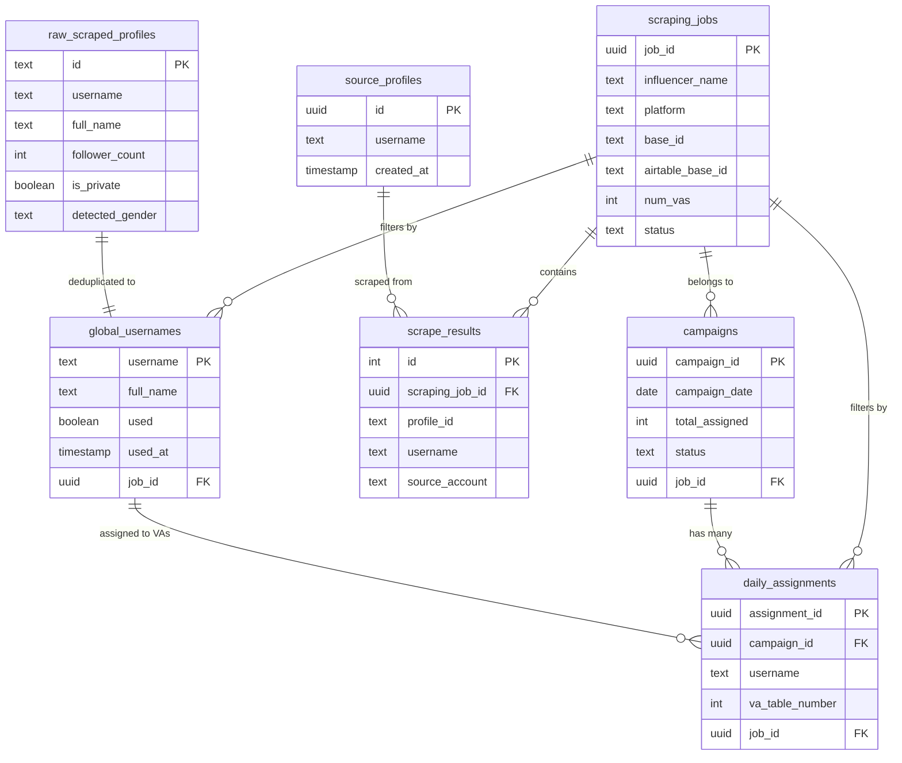

## Database Architecture

The Click Creators Scraper Client uses **Supabase** (PostgreSQL) as its primary database, providing a robust, scalable solution for managing Instagram profile scraping, campaign management, and multi-tenant data isolation.

### Technology Stack

- **Database:** PostgreSQL (via Supabase)
- **Client:** Supabase JS Client
- **Authentication:** Row Level Security (RLS)
- **Real-time:** Supabase Real-time subscriptions
- **Multi-tenancy:** base_id-based data isolation

## Multi-Tenant Architecture

### Base ID Isolation

The platform implements **multi-tenant data isolation** using Airtable base IDs (`base_id`). Each scraping job is associated with a specific Airtable base, ensuring complete data separation between different clients/projects.

```typescript
// Create a tenant-specific Supabase client
import { createSupabaseClientWithContext } from '@/lib/supabase'

const client = createSupabaseClientWithContext(baseId)
```

<Note>
  All database queries automatically filter by `base_id` when using the context-aware client, preventing data leakage between tenants.
</Note>

### How RLS Works

The database uses Row Level Security (RLS) policies that read the `x-base-id` header from requests:

```sql
-- Example RLS Policy
CREATE POLICY "Users can only see their own data"
  ON scraping_jobs
  FOR SELECT
  USING (
    base_id = current_setting('request.headers')::json->>'x-base-id'
  );
```

## Database Tables

The platform uses **7 core tables** organized into three functional categories:

### 1. Scraping Configuration

<Card title="scraping_jobs" icon="briefcase" href="/database/scraping-jobs">
  Multi-tenant scraping job management for different platforms (Instagram, Threads, TikTok, X)
</Card>

<Card title="source_profiles" icon="user-plus" href="/database/profiles">
  Instagram accounts to scrape followers from
</Card>

### 2. Profile Storage

<Card title="raw_scraped_profiles" icon="database" href="/database/profiles">
  Complete profile data from Instagram scraper (full details preserved)
</Card>

<Card title="global_usernames" icon="hashtag" href="/database/profiles">
  Deduplicated username pool with usage tracking
</Card>

<Card title="scrape_results" icon="list-check" href="/database/profiles">
  Linking table connecting scraped profiles to jobs
</Card>

### 3. Campaign Management

<Card title="campaigns" icon="calendar" href="/database/campaigns">
  Daily campaign tracking with status and metrics
</Card>

<Card title="daily_assignments" icon="users" href="/database/assignments">
  Profile-to-VA (Virtual Assistant) assignments for campaigns
</Card>

## Entity Relationship Diagram



## Data Flow

### 1. Scraping Pipeline

```
Source Profiles → Apify Scraper → Raw Scraped Profiles → Global Usernames
       ↓                                                          ↓
  (Instagram IDs)                                        (Deduplicated Pool)
```

### 2. Campaign Assignment Pipeline

```
Global Usernames (unused) → Campaign Creation → Daily Assignments → Airtable Sync
       ↓                            ↓                    ↓                 ↓
  (14,400 selected)         (Campaign record)    (80 VAs × 180)    (VA Access)
```

### 3. Multi-Tenant Isolation

```
Scraping Job (base_id: "app123") → All queries filtered by base_id
       ↓
   ┌─────────────────────────────────┐
   │  global_usernames (app123)      │
   │  campaigns (app123)              │
   │  daily_assignments (app123)      │
   │  scrape_results (app123)         │
   └─────────────────────────────────┘
```

## Indexing Strategy

### Primary Indexes

All tables have primary key indexes:

- `scraping_jobs.job_id` (UUID)
- `source_profiles.id` (UUID)
- `raw_scraped_profiles.id` (TEXT)
- `global_usernames.username` (TEXT)
- `campaigns.campaign_id` (UUID)
- `daily_assignments.assignment_id` (UUID)

### Performance Indexes

<Warning>
  These indexes should be created for optimal performance:
</Warning>

```sql
-- Multi-tenant isolation
CREATE INDEX idx_scraping_jobs_base_id ON scraping_jobs(base_id);
CREATE INDEX idx_global_usernames_job_id ON global_usernames(job_id);
CREATE INDEX idx_campaigns_job_id ON campaigns(job_id);
CREATE INDEX idx_daily_assignments_job_id ON daily_assignments(job_id);

-- Query optimization
CREATE INDEX idx_global_usernames_used ON global_usernames(used) WHERE used = false;
CREATE INDEX idx_campaigns_date ON campaigns(campaign_date DESC);
CREATE INDEX idx_daily_assignments_campaign ON daily_assignments(campaign_id);
CREATE INDEX idx_scraping_jobs_platform ON scraping_jobs(platform, status);
```

## Performance Considerations

### Query Optimization

1. **Always use base_id filtering**: Use `createSupabaseClientWithContext()` to automatically filter queries
2. **Limit result sets**: Use pagination for large datasets
3. **Index unused profiles**: Query `global_usernames WHERE used = false` is heavily indexed
4. **Batch operations**: Use bulk inserts for scraping results

### Connection Pooling

Supabase handles connection pooling automatically. For high-traffic scenarios:

```typescript
// Use Supabase's built-in connection pooling
const { data } = await supabase
  .from('global_usernames')
  .select('*')
  .limit(1000) // Reasonable batch size
```

### Real-time Subscriptions

The platform uses Supabase real-time for live updates:

```typescript
supabase
  .channel('scraping_jobs_changes')
  .on('postgres_changes', 
    { 
      event: '*', 
      schema: 'public',
      table: 'scraping_jobs'
    },
    (payload) => {
      // Handle real-time updates
    }
  )
  .subscribe()
```

## Backup and Recovery

### Automated Backups

Supabase provides:

- **Daily automated backups** (retained for 7 days on Pro plan)
- **Point-in-time recovery** (PITR)
- **Manual backup downloads** via Supabase dashboard

### Data Export

```sql
-- Export campaigns for a specific job
COPY (
  SELECT * FROM campaigns 
  WHERE job_id = 'your-job-id'
) TO '/tmp/campaigns.csv' CSV HEADER;
```

## Database Limits

### Supabase Quotas

| Resource | Free Tier | Pro Tier |
|----------|-----------|----------|
| Database Size | 500 MB | 8 GB+ |
| Bandwidth | 2 GB | 50 GB+ |
| API Requests | 500K/month | Unlimited |
| Storage | 1 GB | 100 GB+ |

### Table Size Estimates

<Accordion title="Estimated Storage Requirements">
  - **global_usernames**: ~50 bytes/row → 1M profiles = 50 MB
  - **raw_scraped_profiles**: ~300 bytes/row → 1M profiles = 300 MB
  - **daily_assignments**: ~100 bytes/row → 100K assignments = 10 MB
  - **campaigns**: ~150 bytes/row → 1K campaigns = 150 KB
</Accordion>

## Security Best Practices

### Row Level Security (RLS)

<Warning>
  Always enable RLS on all tables in production:
</Warning>

```sql
ALTER TABLE scraping_jobs ENABLE ROW LEVEL SECURITY;
ALTER TABLE global_usernames ENABLE ROW LEVEL SECURITY;
ALTER TABLE campaigns ENABLE ROW LEVEL SECURITY;
ALTER TABLE daily_assignments ENABLE ROW LEVEL SECURITY;
```

### API Key Management

- **Never expose service_role key** in frontend code
- Use **anon key** for client-side operations
- Implement RLS policies to control data access

### Environment Variables

```bash
NEXT_PUBLIC_SUPABASE_URL=https://your-project.supabase.co
NEXT_PUBLIC_SUPABASE_ANON_KEY=your-anon-key
# NEVER commit service_role_key to version control!
```

## Next Steps

<CardGroup cols={2}>
  <Card title="Scraping Jobs" icon="briefcase" href="/database/scraping-jobs">
    Learn about multi-tenant job configuration
  </Card>
  <Card title="Profile Tables" icon="user" href="/database/profiles">
    Understand profile storage and deduplication
  </Card>
  <Card title="Campaigns" icon="calendar" href="/database/campaigns">
    Explore campaign management
  </Card>
  <Card title="Assignments" icon="users" href="/database/assignments">
    See how profiles are assigned to VAs
  </Card>
</CardGroup>