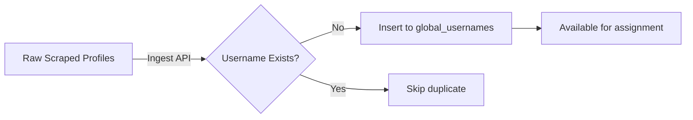
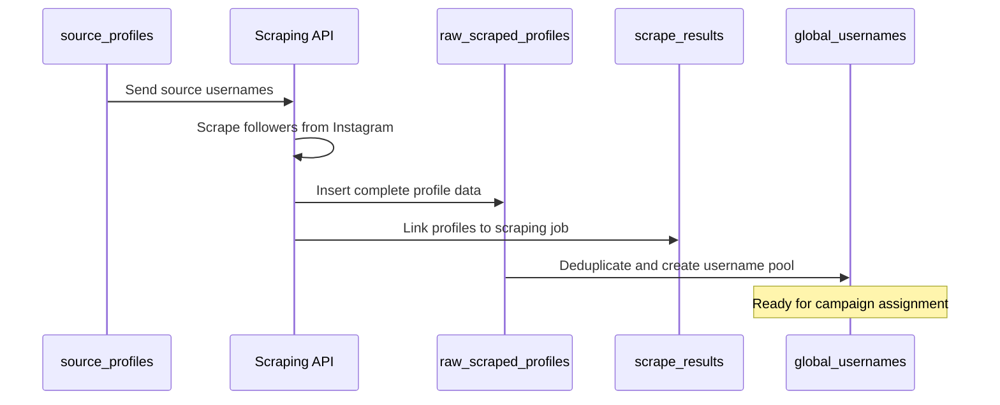

## Overview

The platform uses **4 interconnected tables** to manage Instagram profiles from scraping through assignment:

1. **source_profiles** - Instagram accounts to scrape from
2. **raw_scraped_profiles** - Complete scraped profile data
3. **global_usernames** - Deduplicated username pool
4. **scrape_results** - Linking table for scraping jobs

## 1. Source Profiles

### Purpose

Stores Instagram accounts that serve as **scraping sources**. The platform scrapes followers from these accounts.

### Schema

```sql
CREATE TABLE source_profiles (
  id UUID PRIMARY KEY DEFAULT uuid_generate_v4(),
  username TEXT NOT NULL UNIQUE,
  created_at TIMESTAMP DEFAULT NOW()
);
```

### Column Details

| Column | Type | Constraints | Description |
|--------|------|-------------|-------------|
| `id` | UUID | PRIMARY KEY | Unique identifier |
| `username` | TEXT | NOT NULL, UNIQUE | Instagram username |
| `created_at` | TIMESTAMP | DEFAULT NOW() | When added to system |

### TypeScript Interface

```typescript
interface SourceProfile {
  id: string;
  username: string;
  created_at: string;
}
```

### Common Queries

<CodeGroup>
```typescript Add Source Profile
const { data, error } = await supabase
  .from('source_profiles')
  .insert({ username: 'nike' })
  .select()
  .single()
```

```typescript Get All Sources
const { data: profiles } = await supabase
  .from('source_profiles')
  .select('*')
  .order('created_at', { ascending: false })
```

```typescript Remove Source
const { error } = await supabase
  .from('source_profiles')
  .delete()
  .eq('username', 'nike')
```
</CodeGroup>

### Usage Example

```typescript
// From dependencies-card.tsx
const loadSourceProfiles = async () => {
  const { data, error } = await supabase
    .from('source_profiles')
    .select('username')
    .order('created_at', { ascending: false })

  if (data) {
    setSourceAccounts(data.map(p => p.username))
  }
}
```

<Note>
  Source profiles are **not multi-tenant**. They're shared across all scraping jobs. Each job uses these sources to scrape followers.
</Note>

## 2. Raw Scraped Profiles

### Purpose

Stores **complete profile data** from Instagram scraper. This is the raw, unprocessed data with all available fields preserved.

### Schema

```sql
CREATE TABLE raw_scraped_profiles (
  id TEXT PRIMARY KEY,
  username TEXT,
  full_name TEXT,
  follower_count INTEGER,
  following_count INTEGER,
  post_count INTEGER,
  is_verified BOOLEAN,
  is_private BOOLEAN,
  biography TEXT,
  url TEXT,
  detected_gender TEXT,
  created_at TIMESTAMP DEFAULT NOW()
);
```

### Column Details

| Column | Type | Description |
|--------|------|-------------|
| `id` | TEXT | Instagram profile ID (from API) |
| `username` | TEXT | Instagram username |
| `full_name` | TEXT | Display name |
| `follower_count` | INTEGER | Number of followers |
| `following_count` | INTEGER | Number of following |
| `post_count` | INTEGER | Number of posts |
| `is_verified` | BOOLEAN | Verified badge status |
| `is_private` | BOOLEAN | Private account status |
| `biography` | TEXT | Profile bio |
| `url` | TEXT | Instagram profile URL |
| `detected_gender` | TEXT | Gender detection result (male, female, unknown) |
| `created_at` | TIMESTAMP | When scraped |

### TypeScript Interface

```typescript
interface RawScrapedProfile {
  id: string;
  username: string;
  full_name: string | null;
  follower_count: number | null;
  following_count: number | null;
  post_count: number | null;
  is_verified: boolean | null;
  is_private: boolean | null;
  biography: string | null;
  url: string | null;
  detected_gender: 'male' | 'female' | 'unknown' | null;
  created_at: string;
}
```

### Gender Detection

The platform uses **name-based gender detection** to filter profiles:

```typescript
const response = await fetch(`${API_URL}/api/scrape-followers`, {
  method: 'POST',
  headers: { 'Content-Type': 'application/json' },
  body: JSON.stringify({
    accounts: sourceAccounts,
    targetGender: 'male' // Filter for male profiles
  })
})
```

<Accordion title="Gender Detection Values">
  - **male**: Name detected as male (e.g., "John", "Michael")
  - **female**: Name detected as female (e.g., "Sarah", "Emily")
  - **unknown**: Unable to determine gender from name
</Accordion>

### Common Queries

<CodeGroup>
```sql Get Male Profiles
SELECT username, full_name, follower_count
FROM raw_scraped_profiles
WHERE detected_gender = 'male'
  AND is_private = false
ORDER BY follower_count DESC
LIMIT 100;
```

```sql Profile Statistics
SELECT 
  detected_gender,
  COUNT(*) as count,
  AVG(follower_count) as avg_followers,
  AVG(following_count) as avg_following
FROM raw_scraped_profiles
GROUP BY detected_gender;
```

```sql Find Verified Profiles
SELECT username, full_name, follower_count
FROM raw_scraped_profiles
WHERE is_verified = true
ORDER BY follower_count DESC;
```
</CodeGroup>

## 3. Global Usernames

### Purpose

Deduplicated pool of Instagram usernames with **usage tracking**. This table prevents assigning the same profile to VAs multiple times.

### Schema

```sql
CREATE TABLE global_usernames (
  id UUID PRIMARY KEY DEFAULT uuid_generate_v4(),
  username TEXT NOT NULL,
  full_name TEXT,
  used BOOLEAN DEFAULT FALSE,
  used_at TIMESTAMP,
  created_at TIMESTAMP DEFAULT NOW(),
  job_id UUID REFERENCES scraping_jobs(job_id)
);
```

### Column Details

| Column | Type | Constraints | Description |
|--------|------|-------------|-------------|
| `id` | UUID | PRIMARY KEY | Unique identifier |
| `username` | TEXT | NOT NULL | Instagram username |
| `full_name` | TEXT | - | Display name |
| `used` | BOOLEAN | DEFAULT FALSE | Has been assigned to a campaign |
| `used_at` | TIMESTAMP | - | When assigned |
| `created_at` | TIMESTAMP | DEFAULT NOW() | When added to pool |
| `job_id` | UUID | FOREIGN KEY | Links to scraping job (multi-tenant) |

### TypeScript Interface

```typescript
export interface GlobalUsername {
  id: string;
  username: string;
  full_name: string | null;
  used: boolean;
  used_at: string | null;
  created_at: string;
  job_id: string | null;
}
```

<Warning>
  The `job_id` field enables multi-tenant isolation. Queries must filter by `job_id` to prevent data leakage between clients.
</Warning>

### Deduplication Strategy

Profiles flow from `raw_scraped_profiles` to `global_usernames` with deduplication:



### Usage Tracking

When a profile is assigned to a campaign:

```typescript
// Mark usernames as used
const { error } = await supabase
  .from('global_usernames')
  .update({ 
    used: true,
    used_at: new Date().toISOString()
  })
  .in('username', selectedUsernames)
  .eq('job_id', currentJobId)
```

### Common Queries

<CodeGroup>
```typescript Get Unused Count
const { count } = await supabase
  .from('global_usernames')
  .select('*', { count: 'exact', head: true })
  .eq('used', false)
  .eq('job_id', jobId)
```

```typescript Select Unused Profiles
const { data } = await supabase
  .from('global_usernames')
  .select('username, full_name')
  .eq('used', false)
  .eq('job_id', jobId)
  .limit(14400)
  .order('created_at', { ascending: true })
```

```sql Cleanup Old Used Profiles
-- Free profiles from campaigns older than 7 days
UPDATE global_usernames
SET used = false, used_at = NULL
WHERE used = true
  AND used_at < NOW() - INTERVAL '7 days'
  AND job_id = 'your-job-id';
```
</CodeGroup>

### Performance Index

```sql
-- Critical index for unused profile queries
CREATE INDEX idx_global_usernames_unused 
  ON global_usernames(job_id, used, created_at) 
  WHERE used = false;
```

## 4. Scrape Results

### Purpose

Linking table that connects **scraped profiles** to **scraping jobs**. Tracks which profiles came from which scraping operations.

### Schema

```sql
CREATE TABLE scrape_results (
  id SERIAL PRIMARY KEY,
  job_id TEXT NOT NULL,              -- Async scraping job ID
  scraping_job_id UUID,               -- Influencer job reference
  profile_id TEXT NOT NULL,
  username TEXT NOT NULL,
  full_name TEXT,
  source_account TEXT,                -- Which source it was scraped from
  created_at TIMESTAMP DEFAULT NOW(),
  FOREIGN KEY (scraping_job_id) REFERENCES scraping_jobs(job_id)
);
```

### Column Details

| Column | Type | Description |
|--------|------|-------------|
| `id` | SERIAL | Auto-incrementing ID |
| `job_id` | TEXT | Async scraping job identifier |
| `scraping_job_id` | UUID | Links to influencer job (multi-tenant) |
| `profile_id` | TEXT | Instagram profile ID |
| `username` | TEXT | Instagram username |
| `full_name` | TEXT | Display name |
| `source_account` | TEXT | Source profile it was scraped from |
| `created_at` | TIMESTAMP | When scraped |

### TypeScript Interface

```typescript
export interface ScrapeResult {
  id: number;
  job_id: string;
  scraping_job_id: string | null;
  profile_id: string;
  username: string;
  full_name: string | null;
  source_account: string | null;
  created_at: string | null;
}
```

### job_id vs scraping_job_id

<Accordion title="Understanding the Two Job IDs">
  **job_id** (TEXT):
  - Identifier for the **asynchronous scraping operation**
  - Comes from Apify or scraping service
  - Temporary, used for tracking scraping progress
  
  **scraping_job_id** (UUID):
  - Links to the **influencer's scraping job** in `scraping_jobs` table
  - Permanent reference
  - Used for multi-tenant data isolation
</Accordion>

### Common Queries

<CodeGroup>
```typescript Get Results for Job
const { data: results } = await supabase
  .from('scrape_results')
  .select('username, full_name, source_account')
  .eq('scraping_job_id', jobId)
  .order('created_at', { ascending: false })
  .limit(100)
```

```sql Results by Source Account
SELECT 
  source_account,
  COUNT(*) as profile_count,
  COUNT(DISTINCT username) as unique_count
FROM scrape_results
WHERE scraping_job_id = 'your-job-id'
GROUP BY source_account
ORDER BY profile_count DESC;
```

```sql Recent Scraping Activity
SELECT 
  DATE(created_at) as scrape_date,
  COUNT(*) as profiles_scraped,
  COUNT(DISTINCT source_account) as sources_used
FROM scrape_results
WHERE scraping_job_id = 'your-job-id'
  AND created_at > NOW() - INTERVAL '7 days'
GROUP BY DATE(created_at)
ORDER BY scrape_date DESC;
```
</CodeGroup>

## Data Flow

### Complete Scraping Pipeline



### Ingest Process

```typescript
// From ingest API endpoint

// 1. Save to raw_scraped_profiles
await supabase
  .from('raw_scraped_profiles')
  .insert(scrapedProfiles)

// 2. Save to scrape_results (with job linkage)
await supabase
  .from('scrape_results')
  .insert(
    scrapedProfiles.map(p => ({
      job_id: asyncJobId,
      scraping_job_id: influencerJobId,
      profile_id: p.id,
      username: p.username,
      full_name: p.full_name,
      source_account: p.source
    }))
  )

// 3. Deduplicate to global_usernames
await supabase
  .from('global_usernames')
  .upsert(
    scrapedProfiles.map(p => ({
      username: p.username,
      full_name: p.full_name,
      job_id: influencerJobId,
      used: false
    })),
    { onConflict: 'username,job_id', ignoreDuplicates: true }
  )
```

## Best Practices

<CardGroup cols={2}>
  <Card title="Preserve Raw Data" icon="database">
    Always keep complete profile data in `raw_scraped_profiles` for future analysis
  </Card>
  
  <Card title="Multi-Tenant Filtering" icon="filter">
    Always filter `global_usernames` and `scrape_results` by `job_id`
  </Card>
  
  <Card title="Avoid Duplicates" icon="ban">
    Use `upsert` with proper conflict resolution when inserting to `global_usernames`
  </Card>
  
  <Card title="Track Sources" icon="link">
    Record `source_account` in scrape_results to audit scraping effectiveness
  </Card>
</CardGroup>

## Performance Tips

### Indexing

```sql
-- For unused profile queries
CREATE INDEX idx_global_usernames_unused 
  ON global_usernames(job_id, used) 
  WHERE used = false;

-- For scrape results queries
CREATE INDEX idx_scrape_results_job 
  ON scrape_results(scraping_job_id, created_at DESC);

-- For source profile lookups
CREATE INDEX idx_scrape_results_source 
  ON scrape_results(source_account);
```

### Query Optimization

```typescript
// Bad: Fetches all columns
const { data } = await supabase
  .from('raw_scraped_profiles')
  .select('*')

// Good: Select only needed columns
const { data } = await supabase
  .from('raw_scraped_profiles')
  .select('username, full_name, follower_count')
  .limit(100)
```

## Next Steps

<CardGroup cols={2}>
  <Card title="Campaigns" icon="calendar" href="/database/campaigns">
    Learn how profiles are organized into campaigns
  </Card>
  <Card title="Assignments" icon="users" href="/database/assignments">
    See how profiles are assigned to VAs
  </Card>
  <Card title="Scraping Jobs" icon="briefcase" href="/database/scraping-jobs">
    Understand multi-tenant job configuration
  </Card>
  <Card title="API Reference" icon="code" href="/api/profiles/scrape-followers">
    View the scraping API documentation
  </Card>
</CardGroup>