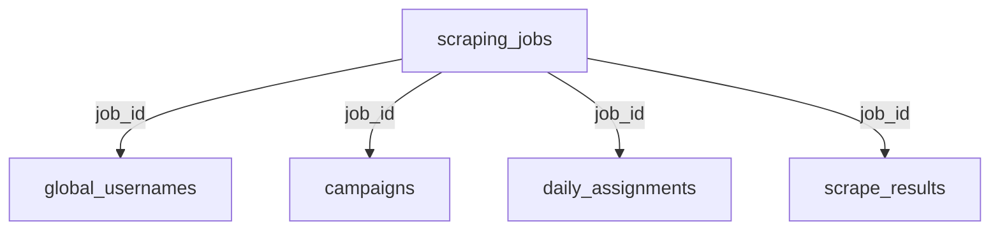

## Overview

The `scraping_jobs` table is the **core of multi-tenant data isolation** in the platform. Each job represents an influencer's scraping configuration for a specific social media platform, linked to an Airtable base for VA management.

## Table Schema

### SQL Definition

```sql
CREATE TABLE scraping_jobs (
  job_id UUID PRIMARY KEY DEFAULT uuid_generate_v4(),
  influencer_name TEXT NOT NULL,
  platform TEXT NOT NULL,
  airtable_base_id TEXT,
  base_id TEXT NOT NULL,  -- Multi-tenant isolation key (extracted from airtable_base_id)
  num_vas INTEGER,
  status TEXT DEFAULT 'active',
  created_at TIMESTAMPTZ DEFAULT NOW(),
  updated_at TIMESTAMPTZ DEFAULT NOW()
);
```

### Column Details

| Column | Type | Constraints | Description |
|--------|------|-------------|-------------|
| `job_id` | UUID | PRIMARY KEY | Unique identifier for the scraping job |
| `influencer_name` | TEXT | NOT NULL | Name of the influencer/brand |
| `platform` | TEXT | NOT NULL | Social media platform (instagram, threads, tiktok, x) |
| `airtable_base_id` | TEXT | - | Full Airtable base URL or ID |
| `base_id` | TEXT | NOT NULL | Extracted Airtable base ID for RLS filtering |
| `num_vas` | INTEGER | - | Number of Virtual Assistants assigned |
| `status` | TEXT | DEFAULT 'active' | Job status (active, paused, archived) |
| `created_at` | TIMESTAMPTZ | DEFAULT NOW() | Job creation timestamp |
| `updated_at` | TIMESTAMPTZ | DEFAULT NOW() | Last update timestamp |

## TypeScript Interface

```typescript
export type Platform = 'instagram' | 'threads' | 'tiktok' | 'x';
export type JobStatus = 'active' | 'paused' | 'archived';

export interface ScrapingJob {
  job_id: string;
  influencer_name: string;
  platform: Platform;
  airtable_base_id: string;
  base_id: string; // Source of truth from DB
  num_vas: number | null;
  status: JobStatus;
  created_at: string;
  updated_at: string | null;
}

export interface CreateScrapingJobInput {
  influencer_name: string;
  platform: Platform;
  airtable_base_id: string;
  num_vas?: number;
  status?: JobStatus;
}
```

<Note>
  The `base_id` field is automatically extracted from `airtable_base_id` during job creation and serves as the **tenant isolation key** for all related data.
</Note>

## Multi-Tenant Isolation

### How base_id Works

The `base_id` is extracted from Airtable URLs:

```typescript
// Example Airtable URL
const url = "https://airtable.com/app123ABC456DEF/tblXYZ";

// Extracted base_id
const base_id = "app123ABC456DEF";
```

### RLS Context

All queries are automatically filtered by `base_id` when using the context-aware client:

```typescript
import { createSupabaseClientWithContext } from '@/lib/supabase'

// Create tenant-specific client
const supabase = createSupabaseClientWithContext(baseId)

// All queries automatically filter by base_id
const { data } = await supabase
  .from('scraping_jobs')
  .select('*') // Only returns jobs for this base_id
```

## Supported Platforms

<Accordion title="Instagram" icon="camera">
  **Platform ID**: `instagram`
  
  - Scrapes Instagram followers
  - Supports gender filtering
  - Links to Instagram profile URLs
  
  ```typescript
  const job: CreateScrapingJobInput = {
    influencer_name: "Nike",
    platform: "instagram",
    airtable_base_id: "app123ABC",
    num_vas: 80
  }
  ```
</Accordion>

<Accordion title="Threads" icon="at">
  **Platform ID**: `threads`
  
  - Scrapes Threads followers
  - Meta/Instagram integration
  - Similar data structure to Instagram
  
  ```typescript
  const job: CreateScrapingJobInput = {
    influencer_name: "Zuck",
    platform: "threads",
    airtable_base_id: "app456DEF",
    num_vas: 50
  }
  ```
</Accordion>

<Accordion title="TikTok" icon="video">
  **Platform ID**: `tiktok`
  
  - Scrapes TikTok followers
  - Support for TikTok-specific metrics
  - Creator marketplace integration
  
  ```typescript
  const job: CreateScrapingJobInput = {
    influencer_name: "CharliDAmelio",
    platform: "tiktok",
    airtable_base_id: "app789GHI",
    num_vas: 100
  }
  ```
</Accordion>

<Accordion title="X (Twitter)" icon="x-twitter">
  **Platform ID**: `x`
  
  - Scrapes X/Twitter followers
  - Supports tweet engagement analysis
  - API rate limit awareness
  
  ```typescript
  const job: CreateScrapingJobInput = {
    influencer_name: "ElonMusk",
    platform: "x",
    airtable_base_id: "appABCDEF",
    num_vas: 75
  }
  ```
</Accordion>

## Job Status Types

### Active

<Card title="Active Jobs" icon="circle-check" color="#16a34a">
  - Currently running or ready to run
  - Appears in job lists and dashboards
  - Can receive new scraped profiles
  - VAs can access assignments
</Card>

### Paused

<Card title="Paused Jobs" icon="circle-pause" color="#ea580c">
  - Temporarily suspended
  - Still visible in job lists
  - No new scraping activities
  - Can be reactivated
</Card>

### Archived

<Card title="Archived Jobs" icon="box-archive" color="#64748b">
  - Completed or deprecated jobs
  - Hidden from active job lists
  - Historical data preserved
  - Cannot be reactivated (must create new job)
</Card>

## Common Queries

### Create a New Job

```typescript
const { data, error } = await supabase
  .from('scraping_jobs')
  .insert({
    influencer_name: 'Nike',
    platform: 'instagram',
    airtable_base_id: 'app123ABC456',
    num_vas: 80,
    status: 'active'
  })
  .select()
  .single()
```

### Get All Active Jobs for a Platform

```typescript
const { data: jobs } = await supabase
  .from('scraping_jobs')
  .select('*')
  .eq('platform', 'instagram')
  .eq('status', 'active')
  .order('created_at', { ascending: false })
```

### Update Job Status

```typescript
const { data } = await supabase
  .from('scraping_jobs')
  .update({ 
    status: 'paused',
    updated_at: new Date().toISOString()
  })
  .eq('job_id', jobId)
```

### Get Job with Statistics

```typescript
// Get job with related counts
const { data: job } = await supabase
  .from('scraping_jobs')
  .select(`
    *,
    username_count:global_usernames(count),
    assignment_count:daily_assignments(count),
    campaign_count:campaigns(count)
  `)
  .eq('job_id', jobId)
  .single()
```

## Relationships

### One-to-Many Relationships



### Cascade Behavior

<Warning>
  Deleting a scraping job will affect related data:
</Warning>

```sql
-- When a job is deleted:
DELETE FROM scraping_jobs WHERE job_id = 'uuid-here';

-- Consider these implications:
-- 1. global_usernames: Profiles may become orphaned
-- 2. campaigns: Historical campaigns lose job reference
-- 3. daily_assignments: Assignments lose job context
-- 4. scrape_results: Results lose job linkage

-- Better approach: Archive instead of delete
UPDATE scraping_jobs 
SET status = 'archived', updated_at = NOW()
WHERE job_id = 'uuid-here';
```

## Example Workflows

### 1. Creating a Complete Scraping Job

```typescript
import { createScrapingJob } from '@/lib/scraping-jobs'

// Step 1: Create the job
const newJob = await createScrapingJob({
  influencer_name: 'Nike',
  platform: 'instagram',
  airtable_base_id: 'app123ABC456',
  num_vas: 80
})

// Step 2: Extract base_id for context
const baseId = newJob.base_id

// Step 3: Create context-aware client
const supabase = createSupabaseClientWithContext(baseId)

// Step 4: All subsequent operations use this client
// (automatically filtered by base_id)
```

### 2. Switching Between Jobs

```typescript
// User selects different job from sidebar
const selectedJob = jobs.find(j => j.job_id === selectedJobId)

if (selectedJob) {
  // Update context to new base_id
  const newClient = createSupabaseClientWithContext(selectedJob.base_id)
  
  // All queries now filter by new base_id
  const { data: profiles } = await newClient
    .from('global_usernames')
    .select('*')
    .limit(100)
}
```

### 3. Job Health Check

```typescript
async function checkJobHealth(jobId: string) {
  const { data: job } = await supabase
    .from('scraping_jobs')
    .select(`
      *,
      profile_count:global_usernames(count),
      unused_count:global_usernames(count).eq.used.false,
      campaign_count:campaigns(count)
    `)
    .eq('job_id', jobId)
    .single()

  return {
    status: job.status,
    hasEnoughProfiles: job.unused_count >= 14400,
    totalProfiles: job.profile_count,
    availableProfiles: job.unused_count,
    totalCampaigns: job.campaign_count
  }
}
```

## Indexing

### Recommended Indexes

```sql
-- Primary key index (automatic)
CREATE UNIQUE INDEX scraping_jobs_pkey ON scraping_jobs(job_id);

-- Multi-tenant queries
CREATE INDEX idx_scraping_jobs_base_id ON scraping_jobs(base_id);

-- Platform filtering
CREATE INDEX idx_scraping_jobs_platform_status 
  ON scraping_jobs(platform, status) 
  WHERE status != 'archived';

-- Recent jobs
CREATE INDEX idx_scraping_jobs_created 
  ON scraping_jobs(created_at DESC);
```

## Best Practices

<CardGroup cols={2}>
  <Card title="Always Use Context" icon="shield">
    Never query scraping_jobs without proper base_id filtering in multi-tenant scenarios
  </Card>
  
  <Card title="Archive, Don't Delete" icon="box-archive">
    Preserve historical data by archiving jobs instead of deleting them
  </Card>
  
  <Card title="Update Timestamps" icon="clock">
    Always update `updated_at` when modifying job records
  </Card>
  
  <Card title="Validate Platform" icon="check">
    Ensure platform values match the allowed enum: instagram, threads, tiktok, x
  </Card>
</CardGroup>

## Next Steps

<CardGroup cols={2}>
  <Card title="Profile Tables" icon="user" href="/database/profiles">
    Learn how profiles are linked to jobs
  </Card>
  <Card title="Campaigns" icon="calendar" href="/database/campaigns">
    See how campaigns reference jobs
  </Card>
  <Card title="Assignments" icon="users" href="/database/assignments">
    Understand job-based assignment filtering
  </Card>
  <Card title="API Reference" icon="code" href="/api/scraping-jobs/create">
    View the job creation API
  </Card>
</CardGroup>