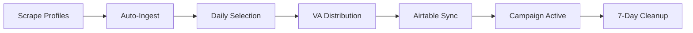
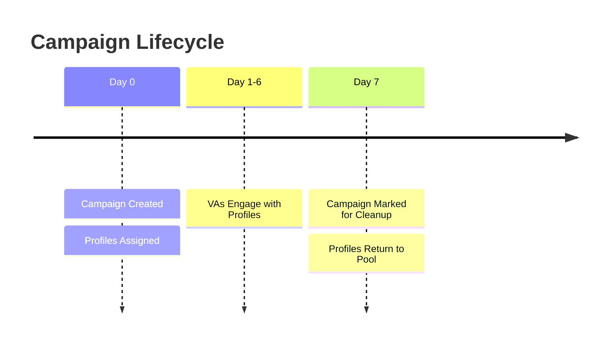

## Overview

Campaigns are the operational units in the Click Creators Scraper Client. Each campaign represents a batch of profiles scraped, selected, and distributed to virtual assistants (VAs) for engagement.

<Note>
  A typical campaign workflow involves: Scraping → Selection → Distribution → Airtable Sync. Each step is tracked with progress indicators and can be monitored in real-time.
</Note>

## Campaign Lifecycle



### Campaign Phases

<Steps>
  <Step title="Scraping Phase">
    Extract follower profiles from source Instagram accounts
  </Step>
  
  <Step title="Ingestion Phase">
    Save and deduplicate profiles in the database
  </Step>
  
  <Step title="Selection Phase">
    Select unused profiles for the daily campaign
  </Step>
  
  <Step title="Distribution Phase">
    Distribute profiles across VA tables
  </Step>
  
  <Step title="Sync Phase">
    Push profiles to Airtable for VA access
  </Step>
  
  <Step title="Active Phase">
    VAs engage with assigned profiles
  </Step>
  
  <Step title="Cleanup Phase">
    Mark 7-day-old profiles as available for reuse
  </Step>
</Steps>

## Starting a Campaign

### Prerequisites

<Warning>
  Before creating a campaign, ensure you have:
  - At least 14,400 unused profiles in the database (for standard 80 VA campaigns)
  - Source accounts configured for scraping
  - Active scraping job selected
</Warning>

### Step 1: Add Source Accounts

<Steps>
  <Step title="Open Dependencies Card">
    Navigate to your job dashboard. The **Dependencies Card** shows your Instagram source accounts.
  </Step>

  <Step title="Edit Source Profiles">
    Click **"Edit Source Profiles"** button. A dialog opens for managing accounts.
  </Step>

  <Step title="Add Instagram Accounts">
    Enter Instagram usernames or URLs in one of these formats:
    
    ```
    // Username only
    andrewcobratate
    
    // Profile URL
    https://www.instagram.com/andrewcobratate/
    
    // Short URL
    instagram.com/andrewcobratate
    ```
    
    Press **Enter** or click the **+** button to add each account.
  </Step>

  <Step title="Save Changes">
    Accounts are automatically saved to the `source_profiles` table in Supabase:
    
    ```typescript
    await supabase
      .from('source_profiles')
      .insert({ 
        username: extractedUsername,
        base_id: currentBaseId 
      })
    ```
  </Step>
</Steps>

<Tip>
  Add multiple source accounts for better profile diversity. The scraper will extract followers from all listed accounts.
</Tip>

### Step 2: Scrape Followers

<Steps>
  <Step title="Initiate Scraping">
    Click the **"Find Accounts"** button in the Dependencies Card.
  </Step>

  <Step title="Scraping Phase (10-50%)">
    The system calls the scraping API:
    
    ```typescript
    const response = await fetch(`${API_URL}/api/scrape-followers`, {
      method: 'POST',
      headers: { 'Content-Type': 'application/json' },
      body: JSON.stringify({
        accounts: sourceAccounts,
        targetGender: 'male'
      })
    })
    ```
    
    **What Happens:**
    - Apify Instagram scraper extracts followers
    - Gender detection filters male profiles
    - Results are collected and prepared for ingestion
    
    <Note>
      Scraping time varies based on:
      - Number of source accounts
      - Followers per account
      - Apify actor performance
      - Rate limiting constraints
    </Note>
  </Step>

  <Step title="Auto-Ingest Phase (60-80%)">
    Automatically triggered after scraping completes:
    
    ```typescript
    // Ingest scraped profiles
    await fetch(`${API_URL}/api/ingest`, {
      method: 'POST',
      body: JSON.stringify({ profiles: scrapedData })
    })
    ```
    
    **What Happens:**
    - Profiles saved to `raw_scraped_profiles` table
    - Usernames deduplicated in `global_usernames` table
    - Profile count statistics updated
  </Step>

  <Step title="Completion (100%)">
    Success message displays:
    - Total profiles scraped
    - New profiles added
    - Duplicate profiles filtered
    
    The Username Status Card updates to show available profile count.
  </Step>
</Steps>

### Step 3: Create Campaign & Assign to VAs

<Steps>
  <Step title="Check Username Status">
    Verify the **Username Status Card** shows sufficient profiles:
    
    ```
    ✅ Ready: 15,000+ available profiles
    ⚠️  Warning: <14,400 available profiles
    ```
  </Step>

  <Step title="Start Campaign">
    Click **"Assign to VAs"** button in the Payments Table.
    
    <Warning>
      This button is disabled if insufficient profiles are available.
    </Warning>
  </Step>

  <Step title="Creating Campaign (0-33%)">
    The daily selection API creates the campaign:
    
    ```typescript
    const response = await fetch(`${API_URL}/api/daily-selection`, {
      method: 'POST',
      headers: { 'x-base-id': baseId }
    })
    ```
    
    **What Happens:**
    - New campaign record created in `campaigns` table
    - 14,400 unused profiles selected from `global_usernames`
    - Selected profiles marked as `used = true`
    - Campaign ID returned for next phases
  </Step>

  <Step title="Distributing (33-66%)">
    Profiles are distributed across VA tables:
    
    ```typescript
    await fetch(`${API_URL}/api/distribute/${campaignId}`, {
      method: 'POST'
    })
    ```
    
    **Distribution Logic:**
    ```
    Total Profiles: 14,400
    Number of VAs: 80
    Profiles per VA: 14,400 ÷ 80 = 180
    
    VA Table 1: Profiles 1-180
    VA Table 2: Profiles 181-360
    ...
    VA Table 80: Profiles 14,221-14,400
    ```
    
    Each assignment is saved to `daily_assignments` table:
    ```typescript
    {
      campaign_id: uuid,
      username: string,
      va_table_number: 1-80,
      position: 1-180,
      status: 'pending'
    }
    ```
  </Step>

  <Step title="Syncing to Airtable (66-100%)">
    Assignments are pushed to Airtable:
    
    ```typescript
    await fetch(`${API_URL}/api/airtable-sync/${campaignId}`, {
      method: 'POST'
    })
    ```
    
    **What Happens:**
    - 80 VA tables updated in Airtable
    - Each VA receives their 180 assigned profiles
    - Campaign status set to 'success'
    - VAs can access profiles immediately
  </Step>

  <Step title="Campaign Complete">
    Success notification appears:
    - Campaign ID
    - Total profiles assigned
    - Campaign date
    
    The campaign appears in the **Campaigns Table**.
  </Step>
</Steps>

## Monitoring Campaigns

### Campaigns Table

The Campaigns Table displays all campaign history:

| Column | Description |
|--------|-------------|
| **Date** | Campaign creation date |
| **Total Assigned** | Number of profiles distributed |
| **Status** | Campaign status indicator |

### Campaign Status Indicators

<Tabs>
  <Tab title="Success">
    🟢 **Green Dot** - Campaign completed successfully
    
    - All profiles distributed
    - Airtable sync successful
    - VAs have access to assignments
    
    ```typescript
    status: true  // Boolean in database
    ```
  </Tab>
  
  <Tab title="Failed">
    🔴 **Red Dot** - Campaign encountered errors
    
    - Distribution failed
    - Airtable sync error
    - Database update failed
    
    ```typescript
    status: false  // Boolean in database
    ```
  </Tab>
</Tabs>

### Real-Time Statistics

The dashboard provides live campaign statistics:

<CardGroup cols={3}>
  <Card title="Available Profiles" icon="users">
    Unused profiles ready for assignment
    
    ```sql
    SELECT COUNT(*) FROM global_usernames 
    WHERE used = false AND base_id = ?
    ```
  </Card>
  
  <Card title="Total Assigned" icon="check">
    Profiles assigned to VAs across all campaigns
    
    ```sql
    SELECT COUNT(*) FROM daily_assignments
    WHERE base_id = ?
    ```
  </Card>
  
  <Card title="Campaigns Created" icon="calendar">
    Total number of campaigns for this job
    
    ```sql
    SELECT COUNT(*) FROM campaigns
    WHERE base_id = ?
    ```
  </Card>
</CardGroup>

## Campaign Data Structure

### Database Schema

<Accordion title="campaigns table">
  ```sql
  CREATE TABLE campaigns (
    campaign_id UUID PRIMARY KEY,
    campaign_date DATE NOT NULL,
    total_assigned INTEGER NOT NULL,
    status BOOLEAN,  -- true = success, false = failed
    created_at TIMESTAMPTZ DEFAULT NOW(),
    base_id TEXT NOT NULL  -- Multi-tenant isolation
  )
  ```
</Accordion>

<Accordion title="daily_assignments table">
  ```sql
  CREATE TABLE daily_assignments (
    assignment_id UUID PRIMARY KEY,
    campaign_id UUID REFERENCES campaigns(campaign_id),
    id TEXT NOT NULL,
    username TEXT NOT NULL,
    full_name TEXT,
    va_table_number INTEGER NOT NULL,  -- 1-80
    position INTEGER NOT NULL,         -- 1-180
    status TEXT DEFAULT 'pending',
    assigned_at TIMESTAMPTZ DEFAULT NOW(),
    base_id TEXT NOT NULL
  )
  ```
</Accordion>

<Accordion title="global_usernames table">
  ```sql
  CREATE TABLE global_usernames (
    id TEXT PRIMARY KEY,
    username TEXT UNIQUE NOT NULL,
    full_name TEXT,
    used BOOLEAN DEFAULT FALSE,
    used_at TIMESTAMPTZ,
    created_at TIMESTAMPTZ DEFAULT NOW(),
    base_id TEXT NOT NULL,
    job_id UUID REFERENCES scraping_jobs(job_id)
  )
  ```
</Accordion>

## Campaign Cleanup

### 7-Day Lifecycle

Campaigns follow a 7-day lifecycle before cleanup:



### Cleanup Process

Run the cleanup API as a cron job:

```bash
# Daily at 2 AM
0 2 * * * curl -X POST http://localhost:5001/api/cleanup
```

**What the cleanup does:**

```typescript
// Mark 7-day-old profiles as unused
UPDATE global_usernames
SET used = false, used_at = NULL
WHERE id IN (
  SELECT id FROM daily_assignments
  WHERE assigned_at < NOW() - INTERVAL '7 days'
)
```

<Note>
  Cleanup allows profile reuse after the engagement window ends, maximizing your profile pool efficiency.
</Note>

## Best Practices

<AccordionGroup>
  <Accordion title="Profile Pool Management">
    - Maintain 2-3x daily target in available profiles
    - Run scraping regularly to replenish pool
    - Monitor the Username Status Card daily
    - Set up alerts when pool drops below 20,000
  </Accordion>
  
  <Accordion title="Campaign Scheduling">
    - Create campaigns at consistent times
    - Allow VAs full access during working hours
    - Avoid creating multiple campaigns per day (profile exhaustion)
    - Schedule cleanup during off-peak hours
  </Accordion>
  
  <Accordion title="VA Distribution">
    - Keep consistent VA counts across campaigns
    - 180 profiles per VA is the recommended workload
    - Don't create campaigns with less than 1 profile per VA
    - Monitor individual VA performance in Airtable
  </Accordion>
  
  <Accordion title="Error Handling">
    - Check campaign status after creation
    - Investigate red status indicators immediately
    - Verify Airtable sync completion
    - Keep API logs for debugging
  </Accordion>
</AccordionGroup>

## Multi-Tenant Considerations

<Note>
  Every campaign operation includes `base_id` context for data isolation.
</Note>

### How It Works

All campaign queries use context-aware Supabase clients:

```typescript
import { createSupabaseClientWithContext } from '@/lib/supabase'

// Create client with base_id context
const supabase = createSupabaseClientWithContext(baseId)

// Queries automatically filtered by base_id
const { data: campaigns } = await supabase
  .from('campaigns')
  .select('*')
  .eq('base_id', baseId)  // Belt-and-suspenders filtering
  .order('campaign_date', { ascending: false })
```

This ensures:
- Campaigns from different jobs never mix
- Statistics are accurate per job
- VA assignments are isolated
- No cross-contamination of profiles

## Troubleshooting

### "Insufficient profiles" Warning

<Accordion title="Solution">
  1. Check current available count in Username Status Card
  2. Run scraping to add more profiles:
     - Add more source accounts
     - Click "Find Accounts"
  3. Verify profiles aren't stuck in "used" state:
     ```sql
     SELECT COUNT(*) FROM global_usernames WHERE used = true
     ```
  4. Consider running cleanup manually to free profiles
</Accordion>

### Campaign Stuck at "Creating Campaign"

<Accordion title="Solution">
  1. Check browser console for API errors
  2. Verify backend API is running
  3. Check Supabase connection
  4. Refresh page and try again
  5. If persistent, check database:
     ```sql
     SELECT * FROM campaigns ORDER BY created_at DESC LIMIT 1
     ```
</Accordion>

### Airtable Sync Failed (Red Status)

<Accordion title="Solution">
  1. Verify Airtable API key is valid
  2. Check Airtable base ID is correct
  3. Ensure all 80 VA tables exist in Airtable
  4. Check Airtable API rate limits
  5. Review backend logs for specific error
  6. Manually retry sync:
     ```bash
     curl -X POST http://localhost:5001/api/airtable-sync/[campaign_id]
     ```
</Accordion>

### Profiles Not Appearing in Airtable

<Accordion title="Solution">
  1. Check campaign status (should be green/success)
  2. Verify you're looking at the correct Airtable base
  3. Check the correct VA table number (1-80)
  4. Refresh Airtable interface
  5. Verify base_id matches between job and Airtable
  6. Check daily_assignments table:
     ```sql
     SELECT * FROM daily_assignments 
     WHERE campaign_id = ? AND va_table_number = 1
     ```
</Accordion>

### Duplicate Profiles in Campaign

<Accordion title="Solution">
  This shouldn't happen due to deduplication, but if it does:
  
  1. Check `global_usernames` for duplicate entries:
     ```sql
     SELECT username, COUNT(*) FROM global_usernames 
     GROUP BY username HAVING COUNT(*) > 1
     ```
  2. Review ingestion logs for errors
  3. Verify scraping API returns unique profile IDs
  4. Clean up duplicates manually:
     ```sql
     DELETE FROM global_usernames 
     WHERE id NOT IN (
       SELECT MIN(id) FROM global_usernames GROUP BY username
     )
     ```
</Accordion>

## Next Steps

<CardGroup cols={2}>
  <Card title="Multi-Platform Guide" icon="grid" href="/guides/multi-platform">
    Learn strategies for managing campaigns across multiple platforms
  </Card>
  
  <Card title="API Reference" icon="code" href="/api/campaigns/daily-selection">
    Explore campaign API endpoints and data structures
  </Card>
</CardGroup>

## Advanced Topics

<CardGroup cols={2}>
  <Card title="Custom Campaign Sizes" icon="sliders">
    Adjust the 14,400 profile target:
    
    ```bash
    # In .env.local
    NEXT_PUBLIC_DAILY_SELECTION_TARGET=10000
    ```
  </Card>
  
  <Card title="Automated Scheduling" icon="clock">
    Set up cron jobs for automated campaign creation:
    
    ```bash
    # Daily campaign at 8 AM
    0 8 * * * curl -X POST http://localhost:3000/api/auto-campaign
    ```
  </Card>
</CardGroup>
